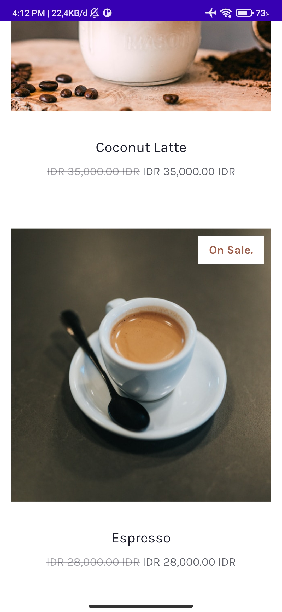
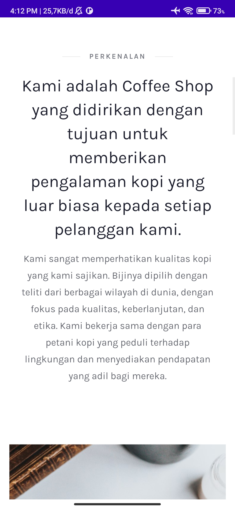

# UAS Pemprograman Visual Kelompok

## Anggota
1. Asya'ri
2. Azzam Muhammad Yusup
3. Muhammad Raihan

## Preview Mobile

 
 
 
 
 
 
 
 
 Download .apk : [Download](https://github.com/asyarbre/uas-pemvis-kelompok/blob/main/apk/app-debug.apk)

## Preview Web

Link Website https://trm4a-kel4.web.app atau https://ngopikuy.webflow.io

## Optimalisasi website

Langkah-langkah yang dilakukan untuk meningkatkan nilai kualitas website dari lighthouse :
1. Serve images in next-gen formats
2. Reduce unused JavaScript
3. Eliminate render-blocking resources
4. Minify Javascript
